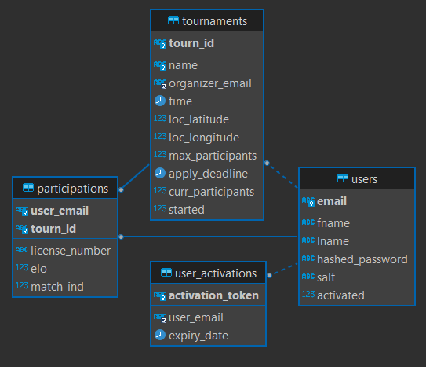

# tournament-system

This is mainly just a project to gain practical experience a "full-stack" implementation of an app with perstisting data in databases.


## Features include:
- Users create their account with an email and password. This password is securely stored with salting.
- Users have to activate their account before performing any actions. An email is sent to them with an Activation Link.
- Each user can create a tournament with a name, location, time, max_participants, application_deadline
- Each use can also participate in other user's tournaments by specifying their 'license_number' and 'elo' for the related discipline - this elo affects with whom the user will be matched during the tournament
- After deadline, the first 1v1 round of matches are generated


## How to run:
- **Cloning repository**
    ```
    git clone https://github.com/AmevinLS/tournament-system
    ```
- **Backend startup**:
    ```
    cd tournament-system/be/app
    pip install requirements.txt
    uvicorn main:app --reload
    ```

- **Frontend startup**:
    ```
    cd tournament-system/fe/tournaments
    npm install
    npm run dev
    ```


## Technologies
- **React** with Bootstrap components (frontend)
- **FastAPI** with uvicorn, **SQLAlchemy** (backend)
- **MySQL** (relational database)


## Database ER diagram:

